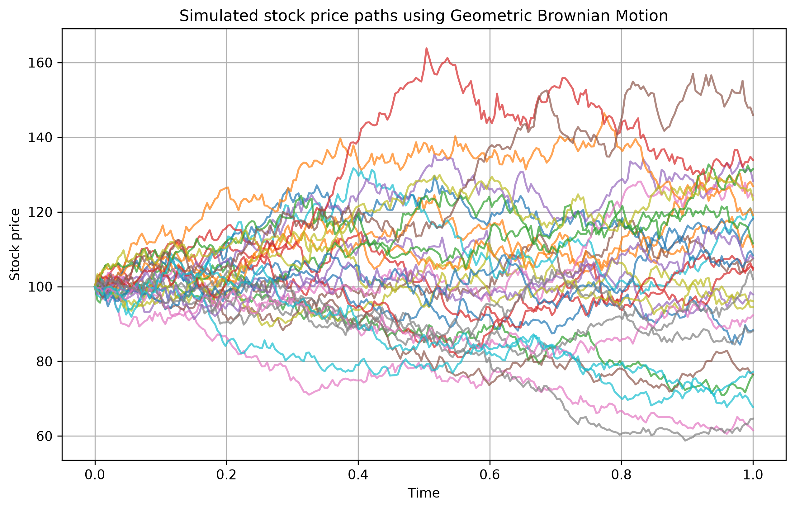
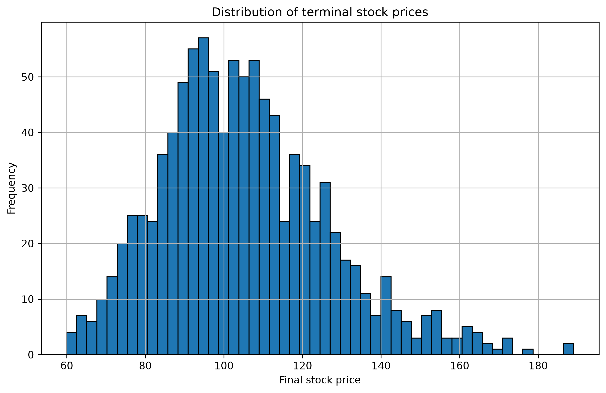
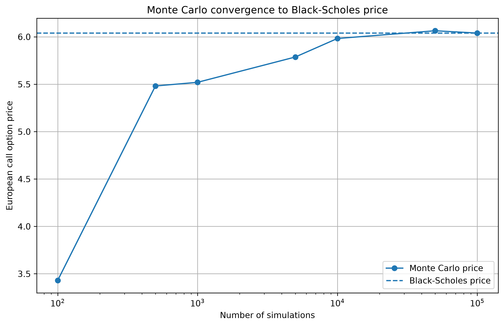
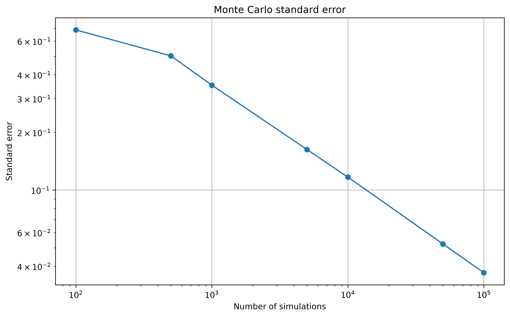

# Monte Carlo Option Pricing

This project uses Monte Carlo simulation to price European financial options under a Geometric Brownian Motion model.

The goal is to simulate many possible future stock price scenarios, compute option payoffs, estimate option prices, and compare the Monte Carlo results with the Black-Scholes analytical benchmark.

## Overview

An option price can be interpreted as the discounted expected value of its future payoff.

Since the future stock price is uncertain, Monte Carlo simulation estimates this expectation by generating many possible stock price outcomes.

The basic workflow is:

```text
simulate stock prices → compute payoffs → average payoffs → discount to present value
```

For a European call option, the payoff is:

```text
max(S_T - K, 0)
```

For a European put option, the payoff is:

```text
max(K - S_T, 0)
```

where `S_T` is the stock price at maturity and `K` is the strike price.

## Methods implemented

* Geometric Brownian Motion stock price simulation
* European call and put payoff functions
* Monte Carlo option pricing
* Standard error and 95% confidence intervals
* Black-Scholes analytical pricing formula
* Convergence analysis as the number of simulations increases

## Example results

Using the parameters:

```text
S0 = 100
K = 110
r = 0.05
sigma = 0.20
T = 1 year
```

the Monte Carlo estimate converges toward the Black-Scholes benchmark as the number of simulations increases.

At 100,000 simulations, the European call estimate is very close to the analytical price:

```text
Monte Carlo price:     6.0397
Black-Scholes price:   6.0401
Absolute error:        0.0004
```

## Visualizations

### Simulated stock price paths



### Terminal stock price distribution



### Monte Carlo convergence



### Standard error convergence



## Project structure

```text
monte-carlo-option-pricing/
├── notebooks/
│   ├── 01_gbm_simulation.ipynb
│   ├── 02_european_options.ipynb
│   ├── 03_black_scholes_comparison.ipynb
│   └── 04_convergence_analysis.ipynb
├── src/
│   ├── simulation.py
│   ├── options.py
│   ├── black_scholes.py
│   ├── statistics.py
│   └── plots.py
├── outputs/
│   └── figures/
├── tests/
│   └── test_black_scholes.py
├── README.md
└── requirements.txt
```

## How to run

Clone the repository:

```bash
git clone https://github.com/amedeone03/monte-carlo-option-pricing.git
cd monte-carlo-option-pricing
```

Create and activate a virtual environment:

```bash
python3 -m venv .venv
source .venv/bin/activate
```

Install dependencies:

```bash
pip install -r requirements.txt
```

Run the tests:

```bash
python -m pytest
```

Open the notebooks:

```bash
jupyter notebook
```

## Limitations

This project uses a simplified financial model.

Main assumptions:

* constant volatility;
* constant risk-free rate;
* no transaction costs;
* no dividends;
* stock prices follow Geometric Brownian Motion;
* the Black-Scholes comparison only applies to standard European options.

This project is intended as a mathematical and computational modelling exercise, not as a real trading system.

## Next steps

Possible extensions:

* Asian option pricing
* Barrier option pricing
* Variance reduction methods
* Antithetic variates
* Control variates
* Sensitivity analysis with respect to volatility, maturity, and strike price
* Streamlit dashboard for interactive pricing

## Tools

Python · NumPy · pandas · SciPy · matplotlib · Jupyter · pytest
